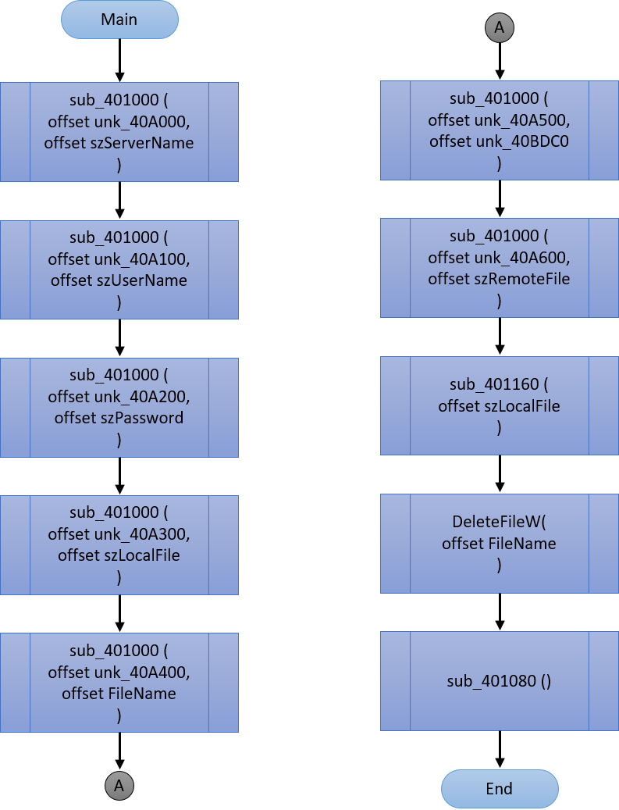

# Disassembly of a Windows Executable

## Approach to Reverse Engineering

I started reverse engineering the Windows PE executable, 18203449.exe, in my reverse engineering environment, which is a virtual machine running Windows XP, by first using ExeinfoPe to identify some information on what was used to create the executable file. I discovered it was Microsoft Visual C++ ver. 8.0 / Visual Studio 2005.

Next, I used IDA Pro to view and manually step through the generated Assembly language code from 18203449.exe, to identify constants, variables, and function or subroutine calls, especially the ones that were user created and to see their code implementation and structure. I started from the main function of the code.
In the `_main` function of the assembly code, I looked through it to get an overview of what was happening. I looked out for:
* The functions or subroutines that are called in the main function. The functions that are called are `sub_401000`, `sub_401160`, `sub_401080`, and `DeleteFileW`
* The branches and structure of the code of this function. The main function had a straightforward flow with no branches

In the `sub_401000` function of the assembly code, I looked through it to get an overview of what was happening. I looked out for:
* The functions or subroutines that are called in `sub_401000`. But there were no calls to other functions or subroutines
* The branches and structure of the code of this function. `sub_401000` code breaks out into 8 sections. The code flows from the top and eventually flows into 7 other sections or branches

In the `sub_401080` function of the assembly code, I looked through it to get an overview of what was happening. I looked out for:
* The functions or subroutines that are called in `sub_401080`. The functions or subroutines that are called are `InternetAttemptConnect`, `InternetOpenW`, `InternetConnectW`, `FtpGetFileW`, `InternetCloseHandle`, `_memset`, `CreateProcessW`, and `WaitForSingleObject`
* The branches and structure of the code of this function. `sub_401080` contained two branches in its code

In the `sub_401160` function of the assembly code, I looked through it to get an overview of what was happening. I looked out for:
* The functions or subroutines that are called in `sub_401160`. The functions or subroutines that are called are `InternetAttemptConnect`, `InternetOpenW`, `InternetConnectW`, `_wcslen`, `FtpPutFileW`, and `InternetCloseHandle`
* The branches and structure of the code of this function. `sub_401160` contained code breaks out into 3 sections. The code flows from the top and eventually flows into 2 other sections or branches

I also found some constants and variables and their memory location. And also the areas of the code they were used and how they were used.

Next, I used OllyDbg to debug and walk through certain sections of the reverse engineered assembly code of 18203449.exe, especially the de-obfuscation function, `sub_401000`.

## Variables (and Constants) Defined in the Program

The variables and constants, as named by IDA Pro’s disassembly process, found in various parts of the program are listed below:

### _main Function

* `szServerName`: This is a variable that would eventually hold a decrypted server name string. Together with the variable unk_40A000, they are passed into the function, sub_401000, that decrypts and produces the original server name string (which eventually was: ftp.ucd.ie), which is then stored in szServerName. In most programming languages, it would be a string-type variable. In x86 Assembly language and C programming language, it would be an array or array-like datatype (i.e. char szServerName [50])
* unk_40A000: This is a variable that holds the string that’s the encrypted representation of a server name. Together with the variable szServerName, they are passed the function, sub_401000, which decrypts the string value stored in unk_40A000. In most programming languages, it would be a string-type variable. In x86 Assembly language and C programming language, it would be an array or array-like datatype (i.e. char unk_40A000[200])
* szUserName: This is a variable that would eventually hold a decrypted username string, to be used in accessing a server. Together with the variable unk_40A100, they are passed into the function, sub_401000, that decrypts and produces the original username string (which eventually was: ahmed@ucd.ie), which is then stored in szUserName. In most programming languages, it would be a string-type variable. In x86 Assembly language and C programming language, it would be an array or array-like datatype (i.e. char szUserName[50])
* unk_40A100: This is a variable that holds the string that’s the encrypted representation of a username. Together with the variable szUserName, they are passed into the function, sub_401000, which decrypts the string value stored in unk_40A100. In most programming languages, it would be a string-type variable. In x86 Assembly language and C programming language, it would be an array or array-like datatype (i.e. char unk_40A100[200])
* szUserPassword: This is a variable that would eventually hold a decrypted password string, to be used in accessing a server. Together with the variable unk_40A200, they are passed into the function, sub_401000, that decrypts and produces the original password string (which eventually was: $ecret123), which is then stored in szUserPassword. In most programming languages, it would be a string-type variable. In x86 Assembly language and C programming language, it would be an array or array-like datatype (i.e. char szUserName[50])
* unk_40A200: This is a variable that holds the string that’s the encrypted representation of a password. Together with the variable szUserPassword, they are passed into the function, sub_401000, which decrypts the string value stored in unk_40A200. In most programming languages, it would be a string-type variable. In x86 Assembly language and C programming language, it would be an array or array-like datatype (i.e. char unk_40A200[200])
* szLocalFile: This is a variable that would eventually hold a decrypted file path string. Together with the variable unk_40A308, they are passed into the function, sub_401000, that decrypts and produces the original file path string (C:\Users\Derbhle\Desktop\receiptPetrov_9316.pdf), which is then stored in szLocalFile. szLocalFile is also later in the _main function code, passed into the function, sub_401160. In most programming languages, it would be a string-type variable. In x86 Assembly language and C programming language, it would be an array or array-like datatype (i.e. char szLocalFile[100])
* unk_40A308: This is a variable that holds the string that’s the encrypted representation of a file path. Together with the variable szLocalFile, they are passed into the function, sub_401000, which decrypts the string value stored in unk_40A308. In most programming languages, it would be a string-type variable. In x86 Assembly language and C programming language, it would be an array or array-like datatype (i.e. char unk_40A308[200])
* FileName: This is a variable that would eventually hold a decrypted file path string. Together with the variable unk_40A408, they are passed into the function, sub_401000, that decrypts and produces the original file path string (C:\Users\Derbhle\Desktop\receipt_Nikolaus218.rtf), which is then stored in FileName. FileName is also later in the _main function code, passed into the function, DeleteFileW. In most programming languages, it would be a string-type variable. In x86 Assembly language and C programming language, it would be an array or array-like datatype (i.e. char FileName[100])
* unk_40A408: This is a variable that holds the string that’s the encrypted representation of a file path. Together with the variable szLocalFile, they are passed into the function, sub_401000, which decrypts the string value stored in unk_40A408. In most programming languages, it would be a string-type variable. In x86 Assembly language and C programming language, it would be an array or array-like datatype (i.e. char unk_40A408[200])
* unk_40BDC0: This is a variable that would eventually hold a decrypted file path string. Together with the variable unk_40A508, they are passed into the function, sub_401000, that decrypts and produces the original file path string (C:\Users\Derbhle\Desktop\accounts_Nikolaus_5923.rtf), which is then stored in unk_40BDC0. In most programming languages, it would be a string-type variable. In x86 Assembly language and C programming language, it would be an array or array-like datatype (i.e. char unk_40BDC0[100])
* unk_40A508: This is a variable that holds the string that’s the encrypted representation of a file path. Together with the variable unk_40BDC0, they are passed into the function, sub_401000, which decrypts the string value stored in unk_40A508. In most programming languages, it would be a string-type variable. In x86 Assembly language and C programming language, it would be an array or array-like datatype (i.e. char unk_40A508[200])
* szRemoteFile: This is a variable that would eventually hold a decrypted file name string. Together with the variable unk_40A608, they are passed into the function, sub_401000, that decrypts and produces the original file name string (2520.exe), which is then stored in szRemoteFile. In most programming languages, it would be a string-type variable. In x86 Assembly language and C programming language, it would be an array or array-like datatype (i.e. char szRemoteFile[100])
* unk_40A608: This is a variable that holds the string that’s the encrypted representation of a file name. Together with the variable szRemoteFile, they are passed into the function, sub_401000, which decrypts the string value stored in unk_40A608. In most programming languages, it would be a string-type variable. In x86 Assembly language and C programming language, it would be an array or array-like datatype (i.e. char unk_40A608[200])

### sub_401000 Function

* var_8: This variable is a local variable. It is a simple variable (i.e. not an array). It is used to pick out which encrypted character value stored in memory is next to be decrypted
* var_4: This variable is a local variable. It is a simple variable (i.e. not an array). It is used to pick out the location in memory where the decrypted character (hexadecimal) value will be stored
* arg_0: This is a function argument. It is a simple variable (i.e. not an array). It is used to pass the memory address value of the location in memory where the encrypted string is stored
* arg_4: This is a function argument. It is a simple variable (i.e. not an array). It is used to pass the memory address value of the location in memory where the decrypted string is to be stored
* byte_40A300: This is a constant that points to the memory location where the (hexadecimal) values that make up the string “\tpkd” are stored

### sub_401080 Function

* var_68: This variable is a local variable. It is a simple variable (i.e. not an array). It is used to pass values for the pointer destination in the _memset function call and used to determine the pointer to a STARTUPINFO structure, which is then used in the CreateProcessW function call
* var_3C: This variable is a local variable. It is a simple variable (i.e. not an array). A hexadecimal value of 100h is assigned to this variable in the code
* hInternet: This variable is a local variable. It is a simple variable (i.e. not an array). Holds the value of a handle returned from the earlier InternetOpenW function call. This value is later on passed into function InternetCloseHandle when it is called
* hHandle: This variable is a local variable. It is a simple variable (i.e. not an array). Holds the value of a handle for the process created by the CreateProcessW function call
* lpStartupInfo: This variable is a local variable. It is a simple variable (i.e. not an array). Holds the offset to the STARTUPINFO, which is supplied as a parameter in the CreateProcessW function call
* hConnect: This variable is a local variable. It is a simple variable (i.e. not an array). Holds the handle of the connected FTP session, which is supplied as a parameter in the FtpGetFileW function call and as a parameter in the InternetCloseHandle function call
* szUserName: This is a variable that holds a decrypted username string, to be used in accessing a server. Its content was set earlier in the _main function before being used in sub_401080 function, where its memory address is passed into the InternetConnectW function call
* szPassword: This is a variable that holds a decrypted password string, to be used in accessing a server. Its content was set earlier in the _main function before being used in sub_401080 function, where its memory address is passed into the InternetConnectW function call
* szServerName: This is a variable that holds a decrypted server name string, to be used in accessing a server. Its content was set earlier in the _main function before being used in sub_401080 function, where its memory address is passed into the InternetConnectW function call
* szRemoteFile: This is a variable that holds a decrypted file name string. Its content was set earlier in the _main function before being used in sub_401080 function, where its memory address is passed into the FtpGetFileW function call, which would be the file to be transferred from an ftp server. The memory address of szRemoteFile is also passed into CreateProcessW function call, as the lpCommandLine parameter

###sub_401160 Function

* hInternet: This variable is a local variable. It is a simple variable (i.e. not an array). Holds the value of a handle returned from the earlier InternetOpenW function call. This value is later on passed into function InternetCloseHandle when it is called
* lpszNewRemoteFile: This variable is a local variable. It is a simple variable (i.e. not an array). Holds the pointer to the string value that is to be the name of the file (receiptPetrov_9316.pdf) to be created on the remote server (ftp.ucd.ie), which is passed as a parameter into the FtpPutFileW function call
* hConnect: This variable is a local variable. It is a simple variable (i.e. not an array). Holds the handle of the connected FTP session, which is supplied as a parameter in the FtpPutFileW function call and as a parameter in the InternetCloseHandle function call
* lpszLocalFile: This variable is a function argument. It is a simple variable (i.e. not an array). Holds the memory address to the string value that is the file path (C:\Users\Derbhle\Desktop\receiptPetrov_9316.pdf) of the file to be sent to a server from the local system, which is passed as a parameter into the FtpPutFileW function call
* szUserName: This is a variable that holds a decrypted username string, to be used in accessing a server. Its content was set earlier in the _main function before being used in sub_401080 function, where its memory address is passed into the InternetConnectW function call
* szPassword: This is a variable that holds a decrypted password string, to be used in accessing a server. Its content was set earlier in the _main function before being used in sub_401080 function, where its memory address is passed into the InternetConnectW function call
* szServerName: This is a variable that holds a decrypted server name string, to be used in accessing a server. Its content was set earlier in the _main function before being used in sub_401080 function, where its memory address is passed into the InternetConnectW function call

## Overall Algorithm of the Program

*Figure 1 Flowchart showing algorithm of _main function*
